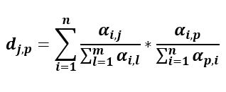

<!-- README.md is generated from README.Rmd. Please edit that file -->

```{r, include = FALSE}
knitr::opts_chunk$set(
  collapse = TRUE,
  comment = "#>",
  fig.path = "man/figures/README-",
  out.width = "100%"
)
```

# mullerinteran

<!-- badges: start -->
<!-- badges: end -->

The goal of mullerinteran is to calculate the interannual indirect effect between two crops for one pollinator species


.





## Installation

You can install the released version of mullerinteran from [CRAN](https://CRAN.R-project.org) with:

``` r
install.packages("mullerinteran")
```

And the development version from [GitHub](https://github.com/) with:

``` r
# install.packages("devtools")
devtools::install_github("LudovicCrochard/mullerinteran")
```
## Example

This is a basic example which shows you how to solve a common problem:

```{r example}
library(mullerinteran)
## basic example code
# muller(ab_tab, start_year = 2015, start_crop = "Cereale", end_crop = "Colza", pol = "Abia_sericea")
```

What is special about using `README.Rmd` instead of just `README.md`? You can include R chunks like so:

```{r cars}
summary(cars)
```

You'll still need to render `README.Rmd` regularly, to keep `README.md` up-to-date.

You can also embed plots, for example:

```{r pressure, echo = FALSE}
plot(pressure)
```

In that case, don't forget to commit and push the resulting figure files, so they display on GitHub!
