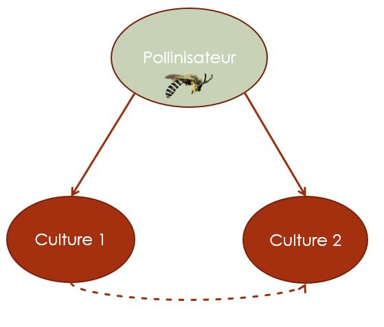

<!-- README.md is generated from README.Rmd. Please edit that file -->
mullerinteran
=============

<!-- badges: start -->
<!-- badges: end -->
The goal of mullerinteran is to calculate the interannual indirect effect between two crops for one pollinator species




Installation
------------

You can install the development version from [GitHub](https://github.com/) with:

``` r
# install.packages("devtools")
# devtools::install_github("LudovicCrochard/mullerinteran")
```

Previous manner of computing the inter annual effect
----------------------------------------------------

``` r
#Community matrix for 2015 and 2016
# dfcompo1516 = compo.new[-c(13:24),]
# ##Decomposition of the Muller index for each crop pair 2 to 2 and pollinator
# nom <- "poll_id" #Creation of the object "column name"
# a = 0 #a allows to go fram one column to another
# X = (nrow(dfcompo1516)*nrow(dfcompo1516)-nrow(dfcompo1516)) #Calculation the number of columns for the table of results
# res <- as.data.frame(matrix(ncol=(X+1),nrow=ncol(dfcompo1516), NA)) #Creation of the results table
# colnames(res) <- c(nom) #assigning the name object to the table column
# 
# for(i in 1:nrow(dfcompo1516)){
#   for(j in (i+1): (nrow(dfcompo1516-1))){ #-1 avoids the calculation of the effect of the last plant on itself
#     a = a+2 #go to the next column for a calculation direction
#     for(k in 1:ncol(dfcompo1516)){
#       res[k,1] = names(dfcompo1516)[k] #allows to give pollinator's name to the line
#       res[k,a] = (dfcompo1516[i,k]/sum(dfcompo1516[1:6,k])*(dfcompo1516[j,k]/sum(dfcompo1516[j,])))
#       res[k,a+1] = (dfcompo1516[j,k]/sum(dfcompo1516[1:6,k])*(dfcompo1516[i,k]/sum(dfcompo1516[i,]))) #calculation the effect for each pollinator
#     }
#   }
# }
# for(i in 1:nrow(dfcompo1516)){
#   for(j in (i+1): (nrow(dfcompo1516-1))){ #-1 avoids the calculation of the effect of the last plant on itself
#     nom=c(nom,paste(rownames(dfcompo1516)[i],rownames(dfcompo1516)[j], sep="_"))
#     nom=c(nom,paste(rownames(dfcompo1516)[j],rownames(dfcompo1516)[i], sep="_")) #evolution of the name of the columns that will take the name of the association of each plant
#     colnames(res) <- c(nom)}}
# #removal of biologically impossible effects
# res1516=res[,c(2,3,4,5,6,8,9,10,12,14,16,18,20,22,24,26,28,30,32,34,36,38,40,42,44,46,47,48,50,52,54,56,58,60,63,64,65,66,68,70,72,74,76,78,80,82,84,86,88,90,92,94,96,98,100,102)]
# res1516_1=res1516
# res1516_1=as.matrix(res1516_1)
# res1516_1[is.nan(res1516_1)]<-0
# res1516_1=as.data.frame(res1516_1)
# res1516_1[,2:ncol(res1516_1)] <- apply(res1516_1[,2:ncol(res1516_1)], 2, as.numeric)
# res1516_1[is.na(res1516_1)]<-0
# res1516_1[196,]=apply(res1516_1, 2, sum)
```

We wanted to transform this code into a function that can be used for any crop, year or species.

Function
--------

``` r
muller <- function(ab_tab, start_year = 2015, start_crop = "Cereale", end_crop = "Colza", pol = "Abia_sericea"){
  
  #ab_tab = compo_new; start_year = 2015; start_crop = "Cereale"; end_crop = "Colza"; pol = "Abia_sericea"
  
  ## Checks
  if (missing(ab_tab)) { stop("Missing ab_tab.") }
  if (missing(start_year)) { stop("Missing start_year") }
  if (missing(start_crop)) { stop("Missing start_crop") }
  if (missing(end_crop)) { stop("Missing end_crop") }
  if (missing(pol)) { stop("Missing pol") }
  if (!is.data.frame(ab_tab)) { stop("ab_tab must be a dataframe.") }
  
  ## Compute end year
  end_year <- start_year + 1
  
  ## Left nominator
# Relab of pol in start_crop at start_year
  alpha_ij <- subset(ab_tab, Year == start_year)
  alpha_ij <- subset(alpha_ij, Culture == start_crop)
  alpha_ij <- alpha_ij[, colnames(alpha_ij) == pol]
  
  ## Right_nominator
# Relab of pol in end_crop at end_year
  alpha_ip <- subset(ab_tab, Year == end_year)
  alpha_ip <- subset(alpha_ip, Culture == end_crop)
  alpha_ip <- alpha_ip[, colnames(alpha_ip) == pol]
  
  ## Compute the left denominator
# Sum of the relab of one species on all the crops for one year
  pol_an       <- subset(ab_tab, Year == start_year )
  pol_an       <- pol_an[, colnames(pol_an) == pol]
  sum_alpha_il <- sum(pol_an)
  
  ## Compute the right denominator
# Sum of all the relab of all the species in one crop
  cult_an      <- subset(ab_tab, Year == end_year)
  cult_an      <- subset(cult_an, Culture == end_crop)
  sp_cult_an   <- cult_an[grep(pattern = "_", x = colnames(cult_an))] # select the column with species relab only
  sum_alpha_pi <- sum(sp_cult_an)
  
  ## effect of the relab of pol on start_crop in start_year on relab of pol on end_crop in end_year
  d_ijp <- (alpha_ij/sum_alpha_il) * (alpha_ip/sum_alpha_pi)
  d_ijp
  } #eo muller
```

Example
-------

This is a basic example which shows you how to solve a common problem:

``` r
library(mullerinteran)
## basic example code
muller(ab_tab = X, start_year = 2005, start_crop = "ipsum", end_crop = "dolor", pol = "Sit_praesent")
```
